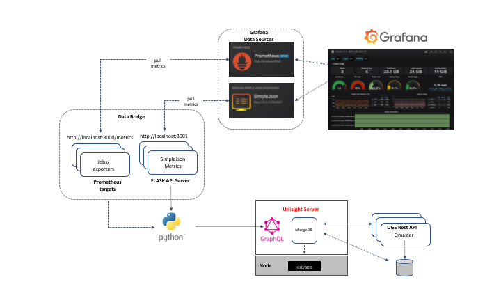

# Grafana + Prometheus

This integration links the data stored in Unisight to Grafana using
Prometheus as an intermediate store.  The application that does the
linking, Unisight Data Bridge, is a simple Flask based Python
application.  The Unisight Data Bridge provides two data sources to
Grafana one indirectly as a Prometheus metric exporter and one
directly as a SimpleJSON data source.

Once complete this integration will provide a Grafana dashboard that
looks like this:


# Architecture

The high level architecture of this integration is illustrated in the
following diagram.



As shown there are 3 components that must be installed in order for
the integration to function.  All should be run as system services
and do not, and likely should not, be on the same machine as the
Unisight server.  If you do wish to run this integration on the 
Unisight server a custom Grafana configuration is required.

## Prometheus

Prometheus is, among other things, provides a very popular open source time
series database solution that is ideal for storing data used to back
visualization frameworks.  Prometheus combines sophsticated filtering
and derived data capabilities with a very performant query interface
and storage backend.

## Grafana

Grafana is a very popular open source visualization tool that can integrate
with many different datasources.  A robust set of data sources is included
in the core product and many more can be added via the Grafana plugin
eco-system.

## Unisight Data Bridge

Authored by Univa the data bridge takes the Unisight GraphQL interface
and exposes it to Prometheus and Grafana.  This approach allows for 
specific custom metrics to be selected from GraphQL so that this 
targeted information can be efficiently stored in Prometheus for real
time graphs and charts rendered by Grafana.

# Installation

The following sections covers the installation process from 
prerequisites through dashboard installation and configuration.

## Prerequisites
The following installation instructions assume that there is both an
existing Univa Grid Engine cluster and a Unisight server installation.
Additionally the Unisight server has already been configured to pull
data from the Univa Grid Engine cluster.  For instuctions on these
two pre-requisites please refer to their product documentation.

The installation can be performed on any platform that is supported
by both Grafana and Prometheus and has at least a Python 2.7 installation
present.  The installation has been tested most significantly on a
CentOS 7 based system.  Additionally the instructions included bellow
assume a systemd enabled system when it comes to service configuration
but should be adaptable to other init systems without much trouble.

## Unisight Data Bridge

The unisight data bridge can be installed from the releases section
of this repo.  It is recommended that you create a new virtual environment
for the installation as opposed to installing the package in your 
base Python installation.  On a clean CentOS 7 machine this can be
accomplished with the following commands run as root or via sudo:

```
easy_install pip
pip install virtualenv
virtualenv /opt/unisight-data-bridge
. /opt/unisight-data-bridge/bin/activate
```

Many plaforms will already have pip and may also have Python 3 as the
default.  Please follow the appropriate instructions based on your
platform to install a virtual environment.


Once a virtual environment has been created the application can be installed
with pip.  Prebuilt releases can be found in this repository at:

https://github.com/UnivaCorporation/unisight-visualizations/releases

They can be downloaded and installed locally or directly from the repo
release as so:

    # Local installation
    pip install unisight-data-bridge-1.0.0.tar.gz

    # Installed directly from a release
    pip install https://github.com/UnivaCorporation/unisight-visualizations/releases/download/v1.0.0/unisight-data-bridge-1.0.0.tar.gz

Next a configuration holding the URL, username, and password of the Unisight
GraphQL interface must be created.  As this has a sensitive password contained
it should be placed in a location where only the systemd service user can
read it.

    cat > /etc/sysconfig/unisight-data-bridge << EOF
    GRAPHQL_URL="http://<unisight-host>:<unisight-graphql-port>/graphql"
    GRAPHQL_AUTH="<auth-token>"
    EOF
    chmod 600 /etc/sysconfig/unisight-data-bridge
    
The `<unisight-host>` string should be replaced with the hostname or
IP address of your Unisight server.  The `<unisight-graphql-port>` should
be replaced with your Unisight server's GraphQL port (typically `3000`).
Finally the `<auth-token>` string should be replaced with the HTTP 
Authentication data to use when connecting to the Unisight server.  The
simplest method is HTTP Basic.  Such a token can be created with:

    python -c 'from __future__ import print_function; import base64; \
       print("Basic " + base64.b64encode("graphql_user:graphql_pass".encode()).decode())'

With `graphql_user` replaced with your Unisight user and `graphql_pass`
replaced with your GraphQL password.

With the config file create the following unit file should next be created
at `/etc/systemd/system/unisight-data-bridge.service`:

```
[Unit]
Description=Unisight Data Bridge
Wants=network-online.target
After=network-online.target
 
[Service]
EnvironmentFile=/etc/sysconfig/unisight-data-bridge
Type=simple
ExecStart=/opt/unisight-data-bridge/bin/gunicorn -b 127.0.0.1:8001 'unisightDataBridge:create_app()'

[Install]
WantedBy=multi-user.target
```

The service can now be enabled and started by running:

    systemctl enable unisight-data-bridge
    systemctl start unisight-data-bridge

Once started the service can be verified running by checking the `http://localhost:8001/`
URL.  It should behave as follows:

    curl http://localhost:8001/
    This datasource is healthy.

### Additional Security Concerns

To make this installation more secure a dedicated service user could be created and used
to launch `guniciorn` in the `unisight-data-bridge`.  Additionally the HTTPS port for
Unisight could be used but would require adding the CA used to set up Unisight as a 
trusted CA on the machine running the Unisight Data Bridge.

## Prometheus

Prometheus can be downloaded from [here](https://prometheus.io/download/).
Download the appropriate package for your platform and extract it in your
desired location.  For the remainder of this document it will be assumed
to be installed in `/opt/prometheus`.  As of the writing of the article
version 2.11.1 was the most recent version.  Once installed a new systemd
unit file needs to be created to start start Prometheus at boot time.
Create the following file at `/etc/systemd/system/prometheus.service`

```
[Unit]
Description=Prometheus
Wants=network-online.target
After=network-online.target
 
[Service]
Type=simple
ExecStart=/opt/prometheus/prometheus \
    --config.file /opt/prometheus/prometheus.yml
 
[Install]
WantedBy=multi-user.target
``` 

Additionally a configuration change must be made so that Prometheus will
scrape data from the Unisight Data Bridge.  Update `/opt/prometheus/prometheus.yml`
so that the `scrape_configs` section looks like:

```
scrape_configs:
  # The job name is added as a label `job=<job_name>` to any timeseries scraped from this config.
  - job_name: 'prometheus'

    # metrics_path defaults to '/metrics'
    # scheme defaults to 'http'.

    static_configs:
    - targets: ['localhost:9090']
  - job_name: 'unisight-data-bridge'

    # metrics_path defaults to '/metrics'
    # scheme defaults to 'http'.

    static_configs:
    - targets: ['localhost:8001']
```

Prometheus can now be enabled and started.

    systemctl enable prometheus
    systemctl start prometheus

### Additional Security Concerns

Creating a dedicated user for the Prometheus server would increase the security of this
configuration.

## Grafana

The installation instructions for Grafana can be found [here](https://grafana.com/docs/installation/).
Grafana has very good instructions for all of its supported platforms.  Follow these
to the point where you have grafana up and running as an enabled service.  The most common
tested installation is CentOS 7 via the Grafana yum repository.  As of this writting
version 6.2.5 was installed.  Following the instructions for CentOS 7 reduces to the following
commands:

    # Create grafana.repo in /etc.yum.repod.d with the contents specified
    yum install -y grafana
    systemctl daemon-reload
    systemctl start grafana-server
    systemctl enable grafana-server.service

*NOTE: If you are running this integration on the Unisight server you will have an error starting
the Grafana service due to a port conflict on 3000 with the Unisight server.  The Grafana port can
be changed to a value other than 3000 in `/etc/grafana/grafana.ini`.  After changing this port the
service can be restarted manually.*

Before moving to the UI configuration of Grafana a couple Grafana Plugins need to be installed in 
order to use the sample dashboard described in subsequent sections of this documentation.  The
installation of the plugins is most easily accomplished by running the following commands:

    grafana-cli plugins install grafana-simple-json-datasource
    grafana-cli plugins install flant-statusmap-panel
    systemctl restart grafana-server

Now that the Grafana service is enabled and running the remaining configuration steps are done
through the Grafana UI.

### Configuring Grafana

Navagite to port 3000 (or the port manually configured in the `grafana.ini` file) on the machine
where you installed Grafana to access its web interface.  The default username and password are
`admin`.  After logging in change the password if you wish.

#### Adding Data Sources

The first step in configurating Grafana is adding the necessary data sources.  Click on the 
'Gear' icon on the left menu bar and select 'Data Sources'.  Click the 'Add Data Source'
button and then select 'Prometheus'.  In the 'Prometheus' configuration enter `http://localhost:9090`
in the URL field.  Finally click 'Save & Test' to commit the changes.

Next add a SimpleJSON data source by once again clicking the 'Gear' icon and selecting 'Data Sources'.
Click the 'Add Data Source' button and then select 'SimpleJSON'.  In the 'SimpleJSON' configuration enter
`http://localhost:8001/` in the URL field.  Finally click 'Save & Test' to commit the changes.

### Importing a Dashboard

With the data sources added the next step is configuring a Dashboard.  A sample dashboard has been
created and published to the Grafana dashboard service.  This dashboard can easily be imported into
the new installation.  First click the 'Plus' icon on the left of the UI and select 'Import'.  In the
'Grafana.com Dashboard' text box enter `10565` and click 'Load'.  In the dashboard configuration page
select the 'Prometheus' datasource and the 'SimpleJSON' data source in their respective drop downs.
Finally click 'Import' to import the dashboard.  The default dashboard should now be drawn.

You can preview a populated view of this dashboard by checking out its webpage on 
[Grafana.com](https://grafana.com/grafana/dashboards/10565).

### Additional UGE Configuration

The default dashboard requires additional Univa Grid Engine configuration for all of its widgets to
function properly.  Specifically new Custom Resources and a load sensor must be added.  The load sensor
monitors disk space and checks if a single execd binary is running on the target machine.

#### Adding the Complex Resources
    
The complex resources can be added using the following commands:
 
    qconf -sc > /tmp/sconf
    echo "execd_running execd_running       INT         <=    NO NO        0        0    NO    0.000000" >> /tmp/sconf
    echo "scratch_mounted scratch_mounted   INT         <=    NO NO        0        0    NO    0.000000" >> /tmp/sconf
    echo "opt_total_space opt_total_space   DOUBLE      <=    NO NO        0        0    NO    0.000000" >> /tmp/sconf
    echo "opt_used_space opt_used_space     DOUBLE      <=    NO NO        0        0    NO    0.000000" >> /tmp/sconf
    echo "opt_avail_space opt_avail_space   DOUBLE      <=    NO NO        0        0    NO    0.000000" >> /tmp/sconf
    qconf -Mc /tmp/sconf

#### Adding the Load Sensor

The load sensor is stored in this repo [here](grafana_prometheus_resources/loadsensor.sh).  Place
it in the shared `$SGE_ROOT/$SGE_CELL` directory of your cluster
as `loadsensor.sh` and then run the following command:

    chmod a+x $SGE_ROOT/$SGE_CELL/loadsensor.sh
    qconf -sconf | grep -v '^load_sensor' > /tmp/global
    echo "load_sensor $SGE_ROOT/$SGE_CELL/loadsensor.sh" >> /tmp/global
    qconf -Mconf /tmp/global

## Next Steps

This default dashboard is just a sample of what you can do with the system feel free to change it,
copy it, and add new graphs as desired.  Additionally the Unisight Data Bridge can be customized
to product even more metrics that can then be consumed and rendered in Grafana.
